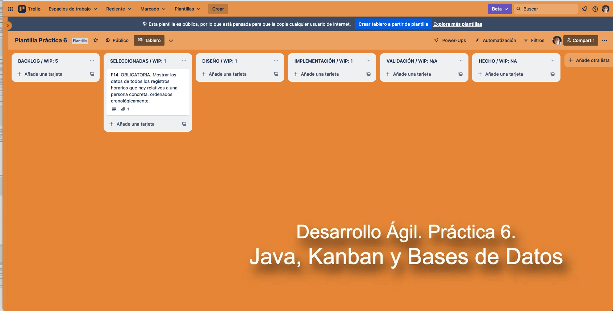
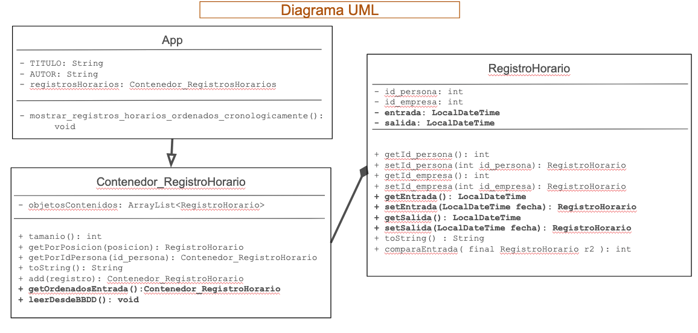
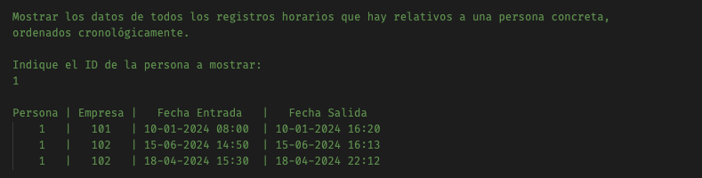
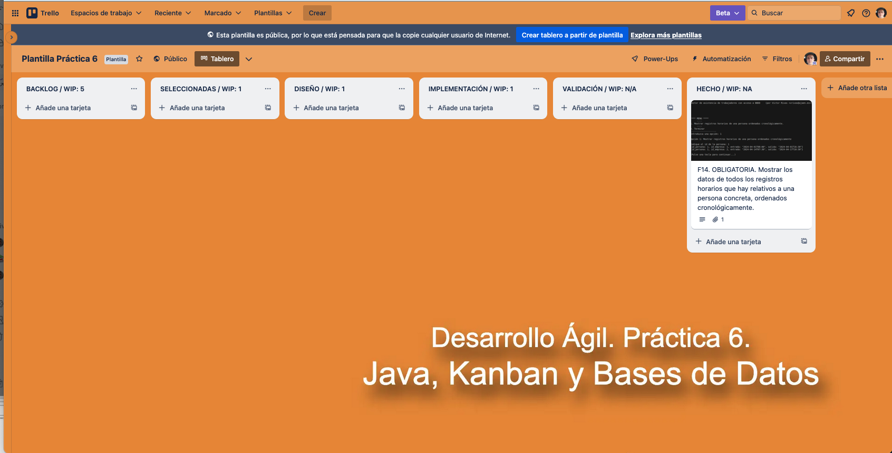

# Plantilla práctica 6. Creación de una app en Java, con conexión a BBDD y metodología Kanban.

## Datos personales del autor

- **Nombre**: Víctor Manuel Rivas Santos.
- **E-mail**: vrivas@ujaen.es
- **Asignatura**: Desarrollo Ágil / Curso 2023-2024

## Tablero Trello

La dirección de la plantilla para usar en Trello es: [https://trello.com/b/k2wlTNR5/plantilla-practica-6-23-24](https://trello.com/b/k2wlTNR5/plantilla-practica-6-23-24)

A continuación, en la [tabla 1](#tabla-listas-wip), muestro el WIP que he asignado en el tablero Trello:
<anchor id="tabla-listas-wip"/>

<!-- TODO Termina de completar la tabla, añadiendo las listas que faltan e indicando el WIP de cada una de las listas de Trello -->

| Lista          | WIP |
| -------------- | :-: |
| Backlog        |  5  |
| Seleccionadas  |  1  |
| Diseño         |  1  |
| Validación     |  1  |
| Implementación |  1  |
| Hecho          | NA  |

**Tabla 1.** Listas del tablero Trello con indicación del WIP asignado a cada una de ellas.

## Incremento número 1.

El primer incremento es el proporcionado por el profesor de la asignatura. Contiene una sola HU, que es la que se pedía como OBLIGATORIA en el listado de HU proporcionado.

### HU seleccionadas para este incremento

Para este primer incremento nos centramos exclusivamente en la HU que obligatoriamente había que implementar:

- F14. OBLIGATORIA. Mostrar los datos de todos los registros horarios que hay relativos a una persona concreta, ordenados cronológicamente.

Como puede verse en la [ilustración 1](#ilustracion-seleccionadas-incr-1), el tablero Trello muestra que solo una HU ha sido seleccionada para formar parte del primer incremento.

<anchor id="ilustracion-seleccionadas-incr-1"/>

**Ilustración 1.** Tablero Trello con el conjunto de HU seleccionadas para el incremento 1.

### Desarrollo de HU F14. Mostrar los datos de todos los registros horarios que hay en el sistema, ordenados cronológicamente.

**Diagrama Entidad-Relación**

El diagrama Entidad-Relación que puede verse en la [ilustración 2](#ilustracion-er-f14) es muy simple, dado que soloamente tenemos una entidad: `RegistroHorario`. De esta forma, podemos comprobar que no siempre el diagrama UML coincide al 100% con el diagrama ER.

La [ilustración 2](#ilustracion-er-f14) muestra dos posibles formas de representar el diagrama entidad-relación. **No es necesario que representes las dos formas, sino que puedes elegir la que desees**.

<anchor id="ilustracion-er-f14"/>

**Ilustración 2.** Diagrama Entidad-Relación con la entidad creada en la BBDD para poder desarrollar la HU F14.

Para realizar este diagrama Entidad-Relación, hemos utilizado una presentación de Google Drive, disponible en: https://docs.google.com/presentation/d/1nBGS0mg-JMroSNARN_p-E-zMkPpGjXdRkgH4MnBz3e8/edit?usp=sharing

**Diagrama UML**

El diagrama UML necesario para llevar a cabo esta HU es el que se puede ver en la [ilustración 3](#ilustracion-uml-f14). En total. se han utilizado 3 clases: App, RegistroHorario y Contenedor_RegistroHorario.

<anchor id="ilustracion-uml-f14"/>

**Ilustración 3.** Diagrama UML con las clases introducidas para poder desarrollar la HU F14.

Para realizar este diagrama UML, hemos utilizado una presentación de Google Drive, disponible en: https://docs.google.com/presentation/d/1nBGS0mg-JMroSNARN_p-E-zMkPpGjXdRkgH4MnBz3e8/edit?usp=sharing

**Interfaz de Usuario**

Un boceto de lo que podría ser la interfaz de usuario se muestra en la [ilustración 4](#ilustracion-interfaz-f14). Como puede verse, necesitamos que los datos se muestren ordenados cronológicamente. Al no indicar si era por fecha de entrada o de salida, se ha decidido hacer por la fecha de entrada.

<!-- Lo comento porque es solo para que me sirva para hacer la captura de pantalla del boceto de la interfaz

Mostrar los datos de todos los registros horarios que hay relativos a una persona concreta,
ordenados cronológicamente.

Indique el ID de la persona a mostrar:
1

Persona | Empresa |   Fecha Entrada   |   Fecha Salida
    1   |   101   | 10-01-2024 08:00  | 10-01-2024 16:20
    1   |   102   | 15-06-2024 14:50  | 15-06-2024 16:13
    1   |   102   | 18-04-2024 15:30  | 18-04-2024 22:12

-->

<anchor id="ilustracion-interfaz-f14"/>

**Ilustración 4.** Mockup de la HU F14.

### Estado del tablero Trello tras finalizar el incremento.

Dado que este incremento solo constaba de una HU, una vez terminada de implementar, probr y validar dicha HU, hemos procedido a marcarla como hecha y reflejarlo así en nuestro tablero Trello (puede verse en
[ilustración 5](#ilustracion-trello-final-incr-1))

<anchor id="ilustracion-trello-final-incr-1"/>

**Ilustración 5.** Estado del tablero Trello al terminar de desarrollar las HU del incremento 1.

<!-- TODO: Documentar el incremento número 2 -->

## Conclusiones (opcional: si no vas a poner nada, bórralo).

Nam bibendum vel nisl vel finibus. Duis augue enim, feugiat nec metus a, aliquam auctor orci. Suspendisse interdum turpis sed elit viverra volutpat. Pellentesque fringilla ullamcorper velit, quis iaculis libero maximus in. Mauris mattis scelerisque libero, consectetur varius sapien ultricies semper. Curabitur velit neque, accumsan quis vestibulum ut, finibus et lectus.
